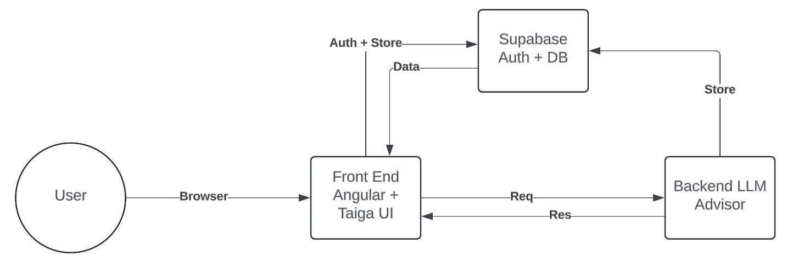

# Insurance Calculator

## Project Overview
- Description: An Angular Progressive Web Application that aids life insurance advisors in assessing clients’ maximum insurable needs. Includes the calculator component for such a task, and the advisor component to assist advisors in answering questions.
- Status: The calculator is able to make all necessary calculations. The advisor is able to answer questions based on user input.

## Installation
- Prerequisites: Standard development tools, such as Git and NPM installed. An internet browser. An internet connection.
- Setup: Clone the repository using Git. Use your computer’s terminal to navigate to the dna-frontend folder. Run `npm install` to install dependencies for the first time, then run `npm start`. Open localhost on the specified port, for example localhost:4200/auth.
- Configuration: The frontend will work out of the box provided you follow the Setup instructions.

## Project Structure
- Dna-frontend
  - Src
    - App
      - Core
        - Components (Contains custom components that aren’t already provided by TaigaUI)
        - Constants (Contains constants that are used by the calculator)
        - Enums (Contains enums that are used by the calculator)
        - Guards (Contains guards that are used by the calculator)
        - Models (Contains interfaces used by the calculator)
        - Services (Contains services used by the calculator)
      - Pages (Contains all the main pages of the calculator)
        - NOTE: There is a Calculator page that contains the navbar and bottom bar. All the other calculator pages are inserted inside the calculator page.
      - Shared
        - Pipe (Contains the pipes used by the calculator)
      - States (Contains state implementation for the calculator)
      - Styles (Global styling)
        - Styles.scss (Global styling)
- Dna-backend
  - packages - A directory of shared INTERNAL packages to be used by one or more services
  - services - A directory of micro services
    - Gateway
      - src
        - server - All server related files
- Dna-advisor
  - lib - Code for implementing a RAG pipeline and using LLM models

## Architecture and Design

## Usage
- Calculator: Navigate to localhost:4200/auth using your internet browser and login or create an account as necessary. Launch the calculator by clicking “Launch Calculator”. Add a new client, and load it using the on-screen buttons. Fill in the forms using your client’s information, using the buttons at the bottom of the screen to navigate through the different forms. The final screen, Total Needs, lists the calculations generated by the app.
- Advisor: Navigate to localhost:4200/auth using your internet browser and login or create an account as necessary. Launch the advisor by clicking “Chat Now”. Use the text input to add a prompt, and click “Send” to await the advisor’s response.
